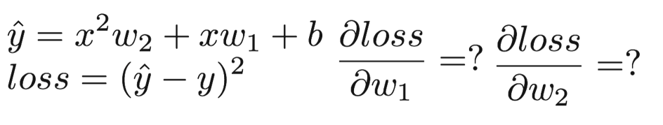

# Assignments of "PyTorchZeroToAll" 

## Lecture 01  Overview
    Exercise 1-1 
        - Install PyTorch on Your computer!

## Lecture 02  Linear Model
    Exercise 2-1 
        - Any other interesting linear prediction problems? 
          Find some datasets for linear prediction
          Draw the cost graph for one dataset 

### Lecture 03  Gradient Descent
    Exercise 3-1 : Compute gradient
    Exercise 3-2 : Implement

### Lecture 04  Back-propagation and Autograd
    Exercise 4-1: x = 2, y=4, w=1
    Exercise 4-2: x = 1, y=2, w=1, b=2
    Exercise 4-3: Implement computational graph and backprop using NumPy
    Exercise 4-4: Compute gradients using computational graph (manually)
    Exercise 4-5: Compute gradients using PyTorch 

### Lecture 05  Linear Regression in the PyTorch way
    Exercise 5-1: Try other optimizers
    - torch.optim.Adagrad
    - torch.optim.Adam
    - torch.optim.Adamax
    - torch.optim.ASGD
    - torch.optim.LBFGS
    - torch.optim.RMSprop
    - torch.optim.Rprop
    - torch.optim.SGD

    Exercise 5-2: Read more PyTorch examples
    http://pytorch.org/tutorials/beginner/pytorch_with_examples.html 

### Lecture 06  Logistic Regression
    Exercise 6-1 : Try different optimizers

### Lecture 07  Wide and Deep
    Exercise 7-1-1 Classifying Diabetes with deep nets(More than 10 layers)
    Exercise 7-1-2 Find other classification datasets(Try with deep network)
    Exercise 7-1-3 Try different activation functions(Sigmoid to something else)

### Lecture 08  PyTorch DataLoader
### Lecture 09  Softmax Classifier
### Lecture 10  Basic CNN
### Lecture 11  Advanced CNN
### Lecture 12  RNN1 - Basics
### Lecture 13  RNN 2 - Classification
